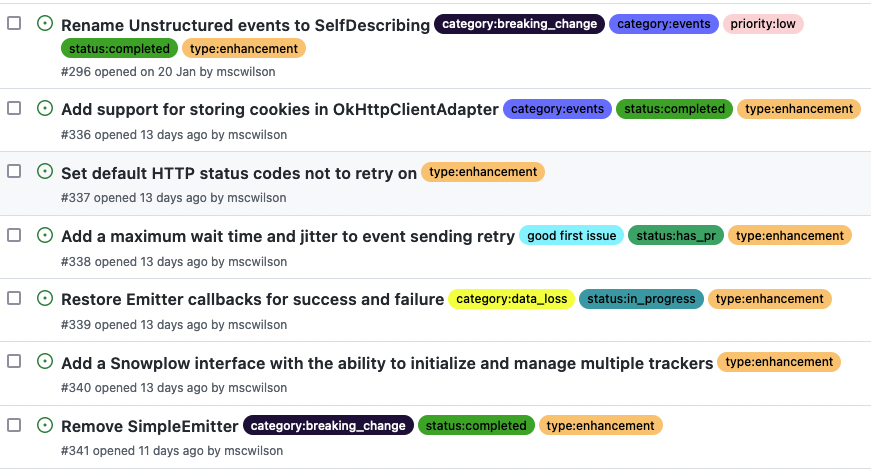

# Labels Helper Action

Keep track of your progress towards a release by automatically labelling issues with their status. It works because of the strict release process workflow - the issue number is always present somewhere.

## Using the Action
Add a workflow like this to your repo (in `.github/workflows`):

```yaml
name: "Labels"
on:
  create:
  pull_request:
    types:
      - opened
  push:
    branches:
      - "release/**"

jobs:
  labels:
    runs-on: ubuntu-latest
    steps:
      - name: Checkout
        uses: actions/checkout@v3

      - name: Update issue status labels
        uses: mscwilson/labels-helper-action@main
        env:
          ACCESS_TOKEN: ${{ secrets.GITHUB_TOKEN }}
```

## What happens if the workflow is triggered?
### On `create`
The workflow will be triggered when a branch or tag is created. If it's a branch called e.g. `issue/123-doing_some_work`, the Action will label issue #123 with `status:in_progress`.

### On `pull_request`
The workflow will be triggered when a PR is opened. If the PR is opened from e.g. `issue/123-doing_some_work`, the Action will label issue #123 with `status:has_pr`.

### On `push` to `release/` branch
The workflow will be triggered when a commit is pushed to a release branch e.g. `release/1.0.1`. If the commit message has the expected structure - e.g. "Did some work (close #123)" - the Action will remove the `status:in_progress` and `status:has_pr` labels from issue #123, and add `status:completed`.

## Example
An example of some similar but manually added labels. Keeping track of progress towards the Java tracker v1.0.0 milestone with status labels:

