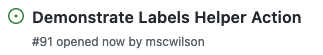
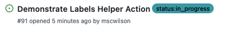
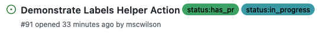
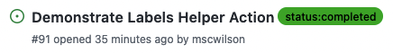

# Labels Helper Action

Keep track of your progress towards a release by automatically labelling issues with their status. It works because of the strict release process workflow - the issue number is always present somewhere.

This action was created during Hackathon July 2022, for internal Snowplow use.

## Using the Action
Add a workflow like this to your repo (in `.github/workflows`):

```yaml
name: "Admin"
on:
  create:
  pull_request:
    types:
      - opened
    branches:
      - 'release/**'
  push:
    branches:
      - "release/**"

jobs:
  update-labels:
    runs-on: ubuntu-latest
    steps:
      - name: Checkout
        uses: actions/checkout@v3

      - name: Update issue status labels
        uses: snowplow-incubator/labels-helper-action@v1
        env:
          ACCESS_TOKEN: ${{ secrets.GITHUB_TOKEN }}
```

## What happens if the workflow is triggered?
Example issue:  



### On `create`
The workflow will be triggered when a branch or tag is created. If it's a branch called e.g. `issue/91-demo_labels_action`, the Action will label issue #91 with `status:in_progress`.  



### On `pull_request`
The workflow will be triggered when a pull request is opened. If the PR is opened from (the head branch) e.g. `issue/91-demo_labels_action`, the Action will label issue #91 with `status:has_pr`.  



### On `push` to `release/` branch
The workflow will be triggered when a commit is pushed to a release branch e.g. `release/1.0.1`. If the commit message has the expected structure - e.g. "Demonstrate Labels Helper Action (close #91)" - the Action will remove the `status:in_progress` and `status:has_pr` labels from issue #91, and add `status:completed`.  



### If it's triggered by something irrelevant
The action will just end without doing anything - it won't throw an error, it will still have a green tick.

Using the workflow above, this action will be still triggered by tag creation, or commits into the release branch such as "Prepare for release". In this case, the Github ref or commit messages won't be in the right structure or contain issue numbers.

## Labels grey, not green?
The Snowplow tracker repos have standardised label sets. Check them out e.g [JavaScript](https://github.com/snowplow/snowplow-javascript-tracker/labels) tracker or [Python](https://github.com/snowplow/snowplow-python-tracker/labels) tracker. The labels and their colours are described [here](https://github.com/snowplow-incubator/data-value-resources/blob/main/20%20Style/GH_issue_labels.md) in the Data Value Resouces repo (or on [Confluence](https://snplow.atlassian.net/wiki/spaces/DVR/pages/2767126529/GitHub+issue+labels)). You can also read there how to copy labels from one repo to another.


## Using the Labels Helper and Pull Request Helper actions together
The [Pull Request Helper Action](https://github.com/snowplow-incubator/pull-request-helper-action) renames a pull request based on its issue, and comments to link the issue. Use them in one workflow like this:

```yaml
name: "Admin"
on:
  create:
  pull_request:
    types:
      - opened
    branches:
      - "release/**"
  push:
    branches:
      - "release/**"

jobs:
  update-labels:
    runs-on: ubuntu-latest
    steps:
      - name: Checkout
        uses: actions/checkout@v3

      - name: Update issue status labels
        uses: snowplow-incubator/labels-helper-action@v1
        env:
          ACCESS_TOKEN: ${{ secrets.GITHUB_TOKEN }}

  link-pr-issue:
    runs-on: ubuntu-latest
    if: github.event_name == 'pull_request'
    steps:
      - name: Checkout
        uses: actions/checkout@v3

      - name: Match the issue to the PR
        uses: snowplow-incubator/pull-request-helper-action@v1
        env:
          ACCESS_TOKEN: ${{ secrets.GITHUB_TOKEN }}
```
